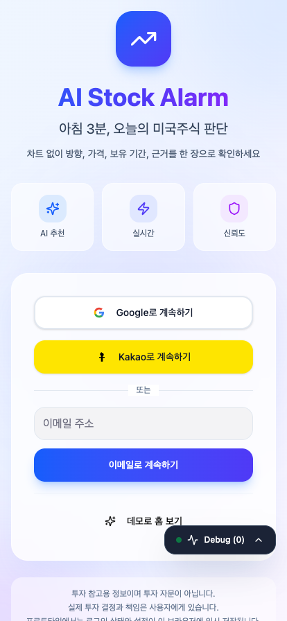
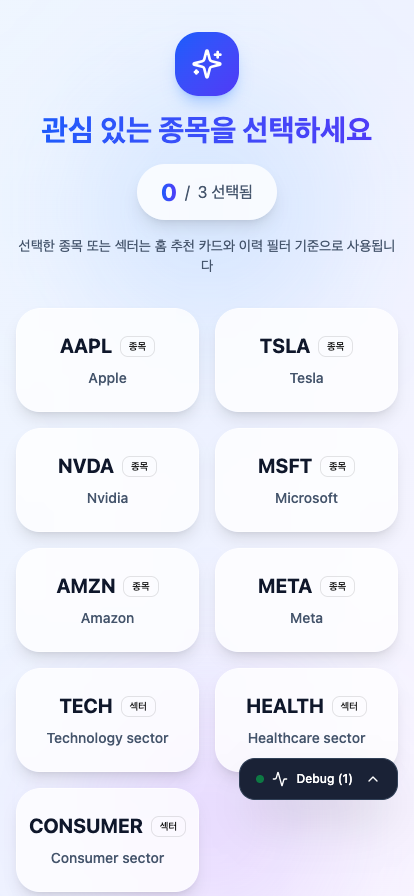
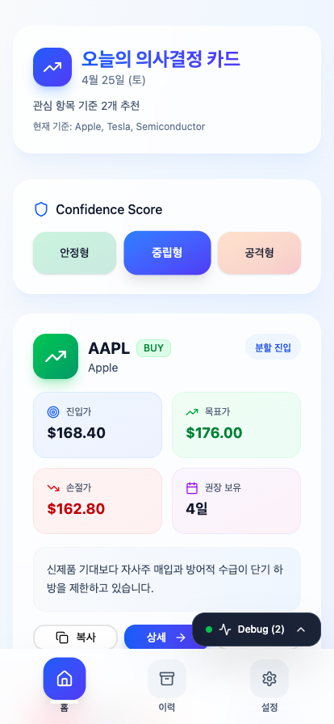
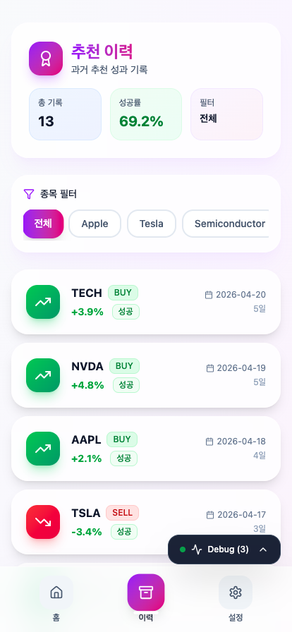
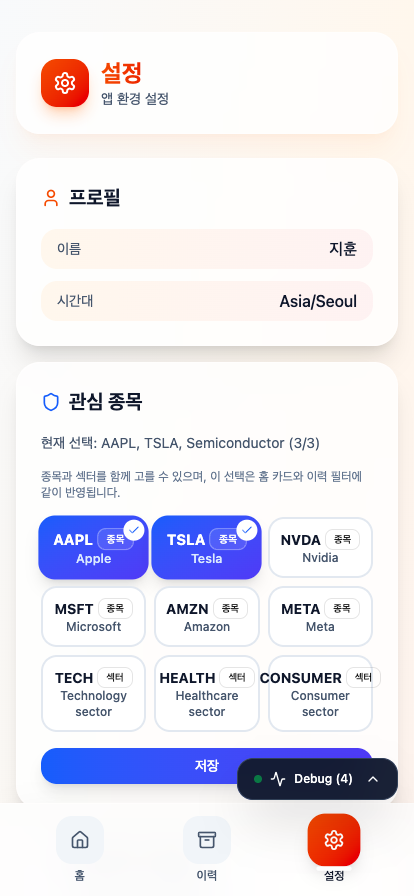

# AI Stock Alarm UI/UX Prototype

이 폴더는 `AI Stock Alarm`의 **UI/UX 검증용 프론트 프로토타입**입니다.  
목표는 실제 백엔드가 붙기 전, 사용자가 `아침 3분 안에 무엇을 볼지`, `어떤 숫자로 판단할지`, `왜 이 추천이 나왔는지`를 직관적으로 이해할 수 있는지 빠르게 확인하는 것입니다.

## 이 프로토타입의 역할

이 앱은 `React + Vite` 기반의 독립형 데모이며, 실제 제품 아키텍처를 완전히 구현한 상태는 아닙니다.

대신 아래를 먼저 검증합니다.

- 로그인 진입 경험
- 온보딩에서 관심 종목/섹터 선택 경험
- 홈에서 1~3개 카드로 압축된 의사결정 흐름
- 상세에서 차트 없이 가격/기간/근거/성과를 읽는 경험
- 이력/설정/상태 화면의 정보 구조
- Confidence Score를 직접 선택하는 UX
- 실패를 숨기지 않는 Trust Layer 표현 방식

## 실제 제품과의 관계

`ai-stock-alarm-app/tasks` 기준으로 실제 제품은 아래 기술 방향을 목표로 합니다.

- `Next.js App Router`
- `Server Components`
- `Server Actions`
- `Prisma`
- `NextAuth`
- `PostHog`
- `OneSignal`
- LLM 기반 추천 카드 생성 파이프라인

이 프로토타입은 그 구현을 대신하지 않지만, 나중에 해당 백엔드가 붙을 때 마찰이 적도록 아래 방향을 반영해 두었습니다.

- `hash route` 기반 화면 진입 구조
- `localStorage` 기반 로그인/관심 종목/리스크 성향/푸시 설정 복원
- `종목 + 섹터`를 함께 다룰 수 있는 watchlist 구조
- 홈/이력/설정이 같은 선택 상태를 공유하는 전역 상태
- 추천 상세 경로를 `/recommendations/:id` 형태로 유지
- 실패 포함 이력과 빈 상태를 분리한 UI 상태 구조

## 제품 원칙

이 프로토타입은 아래 제품 원칙을 따릅니다.

### 1. Decision Layer
- 뉴스 요약 앱이 아니라, 사용자가 바로 판단 가능한 카드 중심 UI를 지향합니다.

### 2. Chartless UI
- 상세 화면 메인 폴드에 차트, RSI, MACD 같은 원본 지표를 두지 않습니다.
- 대신 방향, 진입가, 목표가, 손절가, 보유 기간, 한 줄 이유를 먼저 보여줍니다.

### 3. Risk Choice UX
- Confidence Score는 단순 배지가 아니라 사용자가 직접 선택하는 구조입니다.
- `안정형 / 중립형 / 공격형` 변경 시 추천 숫자와 액션 감각이 같이 바뀌어야 합니다.

### 4. Trust Layer
- 성공 이력만 보여주지 않습니다.
- 실패 기록, 평균 수익률, 데이터 부족 상태를 함께 보여주는 구조를 유지합니다.

## 반영된 업데이트 및 구조 개선 (최신)

이번 정렬 및 리팩토링 작업에서 아래 항목을 반영했습니다.

**1. 아키텍처 및 품질 개선**
- 거대한 페이지 컴포넌트(`HomePageV2`) 내부에 작성되어 있던 인라인 UI 로직을 `RecommendationCard.tsx`로 추출하여 재사용성을 극대화했습니다.
- 비즈니스 로직(가격 복사, 브로커 이동, 성과 계산)을 `useRecommendationActions.ts` 및 `usePerformanceStats.ts` 커스텀 훅으로 분리하여 뷰(View)의 부담을 덜고 응집도를 높였습니다.
- 주요 스크립트(`App.tsx`, `HomePageV2.tsx`, `AppContext.tsx`, 커스텀 훅 등)에 개발자 및 AI 에이전트를 위한 상세한 **Docstring 주석**을 추가했습니다.

**2. 산출 문서 정리**
프로토타입 평가 및 구체적인 아키텍처는 다음 문서를 참고하세요.
- [UX 핵심 시나리오 (UX Flow)](./docs/UX_FLOW.md)
- [컴포넌트 구조 현황 및 개선점 분석](./docs/COMPONENT_ARCHITECTURE.md)
- [코드 품질 평가 보고서](./docs/CODE_QUALITY.md)

**3. 기존 업데이트 내용**

- README를 “실행 방법” 중심이 아니라 “프로토타입 목적 + 제품 방향 + 통합 준비 상태” 중심으로 재작성
- 라우팅을 단순 내부 상태만 쓰는 방식에서 `hash route` 동기화가 가능한 구조로 보강
- 로그인 상태, 관심 항목, 리스크 성향, 푸시 토글을 `localStorage`에 저장해 재진입 시 복원
- watchlist 항목에 `종목 / 섹터` 타입을 명시
- 섹터 선택 시에도 홈 카드와 이력 필터가 의미 있게 동작하도록 목업 데이터 보강
- 홈에서 추천이 없을 때 빈 화면 대신 다음 행동이 있는 상태 카드 제공
- 이력 화면을 최신순 기준으로 정렬하고 필터 라벨을 사람이 읽기 쉬운 이름으로 표시
- 브로커 이동 액션을 실제 외부 이동 대신 “향후 딥링크 연동 예정” 시뮬레이션으로 변경

## 현재 앱 흐름

```text
로그인
  -> 온보딩(관심 종목/섹터 최대 3개 선택)
  -> 홈(오늘의 추천 카드 1~3개)
  -> 추천 상세(가격/근거/성과/액션)

홈
  -> 이력(과거 추천 성과 확인)
  -> 설정(관심 항목, 리스크 성향, 푸시, 상태 화면 테스트)
```

## 화면 미리보기 (Screenshots)

| 로그인 | 온보딩 | 홈(추천 카드) |
|---|---|---|
|  |  |  |

| 이력 | 설정 |
|---|---|
|  |  |

## 화면별 역할

### 로그인
- OAuth/이메일/데모 진입을 보여주는 시작 화면
- 현재는 데모지만, 추후 `NextAuth` 로그인 UX가 들어갈 위치를 미리 검증합니다.

### 온보딩
- 관심 항목을 최대 3개까지 선택합니다.
- `종목`과 `섹터`를 함께 선택할 수 있습니다.
- 이 선택은 홈 카드와 이력 필터 기준으로 이어집니다.

### 홈
- 사용자가 가장 빨리 판단해야 하는 핵심 화면입니다.
- 오늘의 카드 수, 현재 선택된 관심 항목, Confidence Score, 카드 액션을 한 화면에 모읍니다.
- 카드가 없을 때도 이유와 다음 행동을 같이 보여줍니다.

### 추천 상세
- 차트 없이 결과 중심으로 읽는 화면입니다.
- 가격 요약, 근거 스냅샷, 성과 카드, 최근 이력, 액션 버튼을 제공합니다.

### 이력
- 성공/실패를 모두 포함한 추천 결과를 최신순으로 보여줍니다.
- watchlist와 같은 기준으로 필터링합니다.

### 설정
- 관심 항목 수정
- 기본 리스크 성향 변경
- 푸시 수신 토글
- 상태 화면 테스트
- 로그아웃/계정 관리

### 상태 화면
- `No Call`
- `Loading`
- `Empty`
- `Error`

위 상태를 따로 분리해 사용자에게 기술 오류 대신 이해 가능한 피드백을 주는 구조를 검증합니다.

## 라우팅과 상태 관리

현재 프로토타입은 브라우저 라우터 대신 아래 방식을 씁니다.

- `App.tsx`에서 화면 전환 제어
- `#/{route}` 형태의 hash route 동기화
- `/recommendations/:id` 상세 경로 유지

전역 상태는 `AppContext`에서 관리합니다.

- `isLoggedIn`
- `watchlist`
- `riskProfile`
- `pushEnabled`
- `debugEvents`

이 중 핵심 사용자 설정은 브라우저에 임시 저장됩니다.  
실제 제품에서는 이 부분이 `NextAuth + Prisma + Server Actions`로 대체될 예정입니다.

## 백엔드 통합을 염두에 둔 체크 포인트

실제 제품 전환 시 아래 연결을 상정하고 있습니다.

### 인증
- 현재: 프로토타입 로그인 + localStorage
- 실제: `NextAuth`

### 관심 항목 저장
- 현재: context + localStorage
- 실제: `saveWatchlist()` Server Action + Prisma

### 리스크 성향 복원
- 현재: context + localStorage
- 실제: `saveRiskProfile()` + 세션 복원

### 홈/상세/이력 조회
- 현재: `mockData.ts`
- 실제: Query/RSC + DTO 기반 응답

### 푸시/딥링크
- 현재: 화면/상태 시뮬레이션
- 실제: `OneSignal` + 딥링크 랜딩

### 행동 이벤트
- 현재: 우측 하단 Debug Panel
- 실제: `PostHog`

## 관련 주요 파일

- [App.tsx](/Users/hwayoungchoi/Desktop/chy/ai-stock-alarm-project-root/prototypes/Figmaaistockalarmfront/src/app/App.tsx)
- [routes.ts](/Users/hwayoungchoi/Desktop/chy/ai-stock-alarm-project-root/prototypes/Figmaaistockalarmfront/src/app/routes.ts)
- [AppContext.tsx](/Users/hwayoungchoi/Desktop/chy/ai-stock-alarm-project-root/prototypes/Figmaaistockalarmfront/src/app/context/AppContext.tsx)
- [mockData.ts](/Users/hwayoungchoi/Desktop/chy/ai-stock-alarm-project-root/prototypes/Figmaaistockalarmfront/src/app/mockData.ts)
- [LoginPageV2.tsx](/Users/hwayoungchoi/Desktop/chy/ai-stock-alarm-project-root/prototypes/Figmaaistockalarmfront/src/app/pages/LoginPageV2.tsx)
- [OnboardingPageV2.tsx](/Users/hwayoungchoi/Desktop/chy/ai-stock-alarm-project-root/prototypes/Figmaaistockalarmfront/src/app/pages/OnboardingPageV2.tsx)
- [HomePageV2.tsx](/Users/hwayoungchoi/Desktop/chy/ai-stock-alarm-project-root/prototypes/Figmaaistockalarmfront/src/app/pages/HomePageV2.tsx)
- [RecommendationDetailPageV2.tsx](/Users/hwayoungchoi/Desktop/chy/ai-stock-alarm-project-root/prototypes/Figmaaistockalarmfront/src/app/pages/RecommendationDetailPageV2.tsx)
- [ArchivePageV2.tsx](/Users/hwayoungchoi/Desktop/chy/ai-stock-alarm-project-root/prototypes/Figmaaistockalarmfront/src/app/pages/ArchivePageV2.tsx)
- [SettingsPageV2.tsx](/Users/hwayoungchoi/Desktop/chy/ai-stock-alarm-project-root/prototypes/Figmaaistockalarmfront/src/app/pages/SettingsPageV2.tsx)
- [StatePageV2.tsx](/Users/hwayoungchoi/Desktop/chy/ai-stock-alarm-project-root/prototypes/Figmaaistockalarmfront/src/app/pages/StatePageV2.tsx)

## 실행 방법

```bash
npm install
npm run dev
```

## 빠른 검토 순서

1. 로그인에서 `데모로 홈 보기` 클릭
2. 홈에서 Confidence Score를 바꿔 카드가 달라지는지 확인
3. 홈에서 종목과 섹터 기준 카드 개수가 자연스러운지 확인
4. 카드 상세에서 차트 없이도 판단 정보가 충분한지 확인
5. 이력에서 성공/실패/빈 상태가 명확한지 확인
6. 설정에서 관심 항목과 리스크 성향을 바꾼 뒤 새로고침해도 상태가 유지되는지 확인
7. 상태 화면 테스트와 우측 하단 Debug Panel로 예외 흐름 확인
