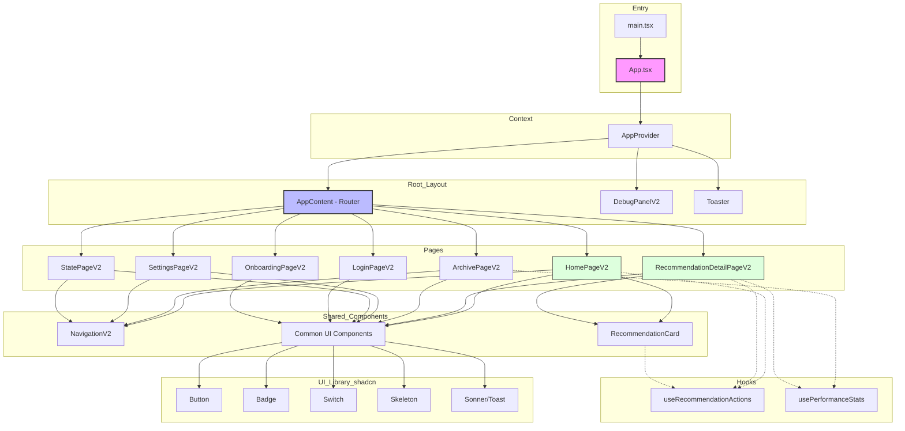

# AI Stock Alarm - 컴포넌트 구조 현황 및 개선점 분석

## 1. 현재 컴포넌트 계층 구조 (Component Tree)

## 2. 현황 분석

- **상태 관리 (State Management)**: `AppContext.tsx`를 통해 전역 상태(관심 종목, 리스크 성향, 로그인 여부 등)를 관리하고 `localStorage`와 동기화하여 지속성을 부여한 점은 매우 안정적입니다.
- **UI 재사용성 (UI Reusability)**: Shadcn UI를 도입하여 `Button`, `Badge` 등의 원자(Atom) 단위 컴포넌트가 잘 구축되어 있습니다. 최근 리팩토링을 통해 복잡한 추천 카드 UI가 `RecommendationCard.tsx`로 추출되어 여러 페이지에서 재사용 가능해졌습니다.
- **로직 분리 (Logic Separation)**: 가격 복사, 알림 설정, 증권사 연동 등의 비즈니스 로직과 통계 계산 로직이 `useRecommendationActions.ts`, `usePerformanceStats.ts` 훅으로 분리되어 뷰(View) 컴포넌트의 무게가 가벼워졌습니다.

## 3. 개선점 및 향후 과제 (Improvement Points)

1. **라우팅 시스템 고도화**
   - **현재**: `routes.ts`와 `AppContent` 내에서 해시(`window.location.hash`) 기반의 자체 라우팅을 사용 중입니다.
   - **개선점**: 프로토타입 단계에서는 충분하나, 추후 인증 가드(Auth Guards), 중첩 라우팅, URL 파라미터(동적 라우팅) 등의 처리가 복잡해질 수 있습니다. 프로덕션 레벨에서는 `react-router-dom` 또는 `Next.js App Router`와 같은 표준 라우터 도입이 필요합니다.

2. **API 통신 계층 추상화**
   - **현재**: `mockData.ts`에 하드코딩된 데이터를 직접 불러와 사용하고 있습니다.
   - **개선점**: 실제 백엔드 연동을 대비하여 `useQuery` (React Query) 또는 SWR을 도입하고, 데이터를 Fetching하는 비동기 서비스 계층(e.g., `api/recommendations.ts`)을 분리해야 합니다.

3. **컴포넌트 분할 (Component Splitting)**
   - **현재**: `SettingsPageV2.tsx`와 같은 페이지는 여전히 설정 섹션(Profile, Watchlist, Push, Account 등)이 하나의 거대한 파일 안에 모두 존재합니다.
   - **개선점**: 유지보수를 위해 각 설정 섹션을 독립된 하위 컴포넌트(e.g., `ProfileSection`, `WatchlistSection`)로 쪼개어 관리하는 것이 좋습니다.
